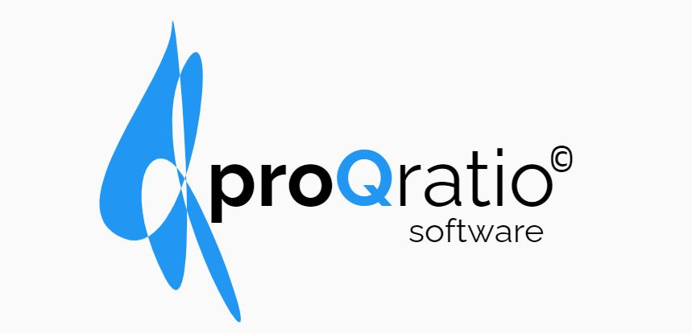

<p align="center">
    <a href="https://github.com/badges/shields/graphs/contributors" alt="Contributors">
        </a>
    <a href="#backers" alt="Backers on Open Collective">
        </a>
    <a href="#sponsors" alt="Sponsors on Open Collective">
        </a>
    <a href="https://github.com/badges/shields/pulse" alt="Activity">
        </a>
    <a href="https://circleci.com/gh/badges/shields/tree/master">
        </a>
    <a href="https://circleci.com/gh/badges/daily-tests">
        </a>
    <a href="https://coveralls.io/github/badges/shields">
        </a>
    <a href="https://lgtm.com/projects/g/badges/shields/alerts/">
        </a>
    <a href="https://discord.gg/HjJCwm5">
        </a>
</p>
<!-- PROJECT LOGO -->
<br />
<div align="center">
    <svg
   xmlns:dc="http://purl.org/dc/elements/1.1/"
   xmlns:cc="http://creativecommons.org/ns#"
   xmlns:rdf="http://www.w3.org/1999/02/22-rdf-syntax-ns#"
   xmlns:svg="http://www.w3.org/2000/svg"
   xmlns="http://www.w3.org/2000/svg"
   xmlns:sodipodi="http://sodipodi.sourceforge.net/DTD/sodipodi-0.dtd"
   xmlns:inkscape="http://www.inkscape.org/namespaces/inkscape"
   width="239.09639"
   height="152.84436"
   viewBox="0 0 63.260918 40.440071"
   version="1.1"
   id="svg8"
   inkscape:version="1.0.2-2 (e86c870879, 2021-01-15)"
   sodipodi:docname="logo2.svg">
  <defs
     id="defs2">
    <rect
       x="85.275391"
       y="161.18777"
       width="45.23053"
       height="18.726015"
       id="rect867" />
    <rect
       x="87.292038"
       y="177.60905"
       width="20.886709"
       height="15.124859"
       id="rect855" />
    <rect
       x="27.944977"
       y="140.73322"
       width="87.003944"
       height="38.892494"
       id="rect835" />
  </defs>
  <sodipodi:namedview
     id="base"
     pagecolor="#ffffff"
     bordercolor="#666666"
     borderopacity="1.0"
     inkscape:pageopacity="0.0"
     inkscape:pageshadow="2"
     inkscape:zoom="2.6683652"
     inkscape:cx="121.19135"
     inkscape:cy="12.832165"
     inkscape:document-units="mm"
     inkscape:current-layer="texto"
     inkscape:document-rotation="0"
     showgrid="false"
     units="px"
     fit-margin-top="0"
     fit-margin-left="0"
     fit-margin-right="0"
     fit-margin-bottom="0"
     inkscape:window-width="2400"
     inkscape:window-height="1271"
     inkscape:window-x="2391"
     inkscape:window-y="-9"
     inkscape:window-maximized="1" />
  <metadata
     id="metadata5">
    <rdf:RDF>
      <cc:Work
         rdf:about="">
        <dc:format>image/svg+xml</dc:format>
        <dc:type
           rdf:resource="http://purl.org/dc/dcmitype/StillImage" />
        <dc:title />
      </cc:Work>
    </rdf:RDF>
  </metadata>
  <g
     inkscape:label="Capa 1"
     inkscape:groupmode="layer"
     id="layer1"
     transform="translate(-13.636172,-125.7107)">
    <g
       id="logo">
      <g
         id="texto">
        <text
           xml:space="preserve"
           id="text833"
           style="font-size:10.5833px;line-height:1.25;font-family:'Bauhaus 93';-inkscape-font-specification:'Bauhaus 93, Normal';white-space:pre;shape-inside:url(#rect835);"><tspan
             x="27.945312"
             y="150.52919"><tspan
               style="font-style:normal;font-variant:normal;font-weight:bold;font-stretch:normal;font-size:10.5833px;font-family:Raleway;-inkscape-font-specification:'Raleway, Bold';font-variant-ligatures:normal;font-variant-caps:normal;font-variant-numeric:normal;font-variant-east-asian:normal">pro</tspan><tspan
               style="font-style:normal;font-variant:normal;font-weight:bold;font-stretch:normal;font-size:10.5833px;font-family:Raleway;-inkscape-font-specification:'Raleway, Bold';font-variant-ligatures:normal;font-variant-caps:normal;font-variant-numeric:normal;font-variant-east-asian:normal;fill:#2196f3;fill-opacity:1">Q</tspan><tspan
               style="font-style:normal;font-variant:normal;font-weight:normal;font-stretch:normal;font-size:10.5833px;font-family:Raleway;-inkscape-font-specification:'Raleway, Normal';font-variant-ligatures:normal;font-variant-caps:normal;font-variant-numeric:normal;font-variant-east-asian:normal">ratio</tspan><tspan
               style="font-style:normal;font-variant:normal;font-weight:normal;font-stretch:normal;font-size:10.5833px;font-family:'Arial Unicode MS';-inkscape-font-specification:'Arial Unicode MS, Normal';font-variant-ligatures:normal;font-variant-caps:normal;font-variant-numeric:normal;font-variant-east-asian:normal"> </tspan></tspan></text>
        <text
           xml:space="preserve"
           style="font-style:normal;font-variant:normal;font-weight:normal;font-stretch:normal;font-size:5.02091px;line-height:1.25;font-family:'Lucida Sans Typewriter';-inkscape-font-specification:'Lucida Sans Typewriter, Normal';font-variant-ligatures:normal;font-variant-caps:normal;font-variant-numeric:normal;font-variant-east-asian:normal;stroke-width:0.125523"
           x="70.388"
           y="146.94511"
           id="text861"
           transform="scale(1.0496278,0.95271866)"><tspan
             sodipodi:role="line"
             id="tspan859"
             x="70.388"
             y="146.94511"
             style="font-style:normal;font-variant:normal;font-weight:normal;font-stretch:normal;font-size:5.02091px;font-family:'Lucida Sans Typewriter';-inkscape-font-specification:'Lucida Sans Typewriter, Normal';font-variant-ligatures:normal;font-variant-caps:normal;font-variant-numeric:normal;font-variant-east-asian:normal;stroke-width:0.125523" /><tspan
             sodipodi:role="line"
             x="70.388"
             y="153.22125"
             style="font-style:normal;font-variant:normal;font-weight:normal;font-stretch:normal;font-size:5.02091px;font-family:'Lucida Sans Typewriter';-inkscape-font-specification:'Lucida Sans Typewriter, Normal';font-variant-ligatures:normal;font-variant-caps:normal;font-variant-numeric:normal;font-variant-east-asian:normal;stroke-width:0.125523"
             id="tspan863">©</tspan></text>
        <text
           xml:space="preserve"
           id="text865"
           style="font-style:normal;font-variant:normal;font-weight:normal;font-stretch:normal;font-size:10.5833px;line-height:1.25;font-family:'Arial Rounded MT Bold';-inkscape-font-specification:'Arial Rounded MT Bold, Normal';font-variant-ligatures:normal;font-variant-caps:normal;font-variant-numeric:normal;font-variant-east-asian:normal;white-space:pre;shape-inside:url(#rect867);"
           transform="matrix(0.42986256,0,0,0.41927617,18.273968,83.655052)"><tspan
             x="85.275391"
             y="170.98426"><tspan
               style="font-style:normal;font-variant:normal;font-weight:normal;font-stretch:normal;font-size:10.5833px;font-family:Raleway;-inkscape-font-specification:'Raleway, Normal';font-variant-ligatures:normal;font-variant-caps:normal;font-variant-numeric:normal;font-variant-east-asian:normal">software</tspan></tspan></text>
      </g>
      <path
         sodipodi:type="star"
         style="fill:#2196f3;fill-opacity:1;fill-rule:evenodd;stroke:#3d3d3d;stroke-width:0;stroke-linejoin:bevel;stroke-dasharray:none"
         id="path843"
         sodipodi:sides="6"
         sodipodi:cx="137.99632"
         sodipodi:cy="116.24534"
         sodipodi:r1="8.6870766"
         sodipodi:r2="7.5232296"
         sodipodi:arg1="2.438362"
         sodipodi:arg2="2.9619608"
         inkscape:flatsided="true"
         inkscape:rounded="-1.32"
         inkscape:randomized="7.101"
         d="m 166.17596,181.40745 c 7.2394,3.75376 -19.82124,-61.27795 -33.34451,-70.28625 -13.52326,-9.00829 -24.30159,15.47539 -2.96694,51.21729 21.33464,35.7419 4.19308,-135.261869 3.16259,-111.398633 -1.03049,23.863235 -60.969122,80.431303 -24.22749,93.538983 36.74164,13.10768 50.51265,-111.178957 30.05494,-75.720897 -20.45772,35.458057 20.08201,108.895747 27.32141,112.649507 z"
         inkscape:transform-center-x="1.1277315e-06"
         transform="matrix(0.26843285,0,0,0.30424878,-12.373607,110.91023)"
         inkscape:transform-center-y="-1.9765575e-06" />
    </g>
    <text
       xml:space="preserve"
       id="text853"
       style="font-size:10.5833px;line-height:1.25;font-family:'Bauhaus 93';-inkscape-font-specification:'Bauhaus 93, Normal';white-space:pre;shape-inside:url(#rect855);" />
  </g>
</svg>
  <a href="https://github.com/othneildrew/Best-README-Template">

  </a>

  <h3 align="center">proQratio® Software</h3>

  <p align="center">
    <br />
    <a href="https://github.com/othneildrew/Best-README-Template"><strong>Explore the docs »</strong></a>
    <br />
    <br /> ·
    <a href="https://github.com/othneildrew/Best-README-Template/issues">Report Bug</a>
    ·
    <a href="https://github.com/othneildrew/Best-README-Template/issues">Request Feature</a>
  </p>
</div>


<!-- TABLE OF CONTENTS -->
<details open="open">
  <summary>Table of Contents</summary>
  <ol>
    <li>
      <a href="#about-the-project">About The Project</a>
      <ul>
        <li><a href="#built-with">Built With</a></li>
      </ul>
    </li>
    <li>
      <a href="#getting-started">Getting Started</a>
      <ul>
        <li><a href="#installation">Installation</a></li>
      </ul>
    </li>
    <li><a href="#usage">Usage</a></li>
    <li><a href="#contributing">Contributing</a></li>
    <li><a href="#license">License</a></li>
    <li><a href="#contact">Contact</a></li>
  </ol>
</details>


<!-- ABOUT THE PROJECT -->
## About The Project 
<div align="center">
 
  </div></br>
proqratio® software is an application that is used to manage the day-to-day problems of companies. With this application you can manage the Logistics department, the Sales department, the HR department, the finance department, among others.
Depending on the role that the user has in the company, they will have visibility to certain parts of the application.
The administrator user will have visibility to all the functionalities of the application and will also be able to manage the users.

### Built With

* [Vuejs](https://vuejs.org/)
* [Nodejs](https://nodejs.org/es/)
* [MongoDB](https://www.mongodb.com/)
* [Express](https://expressjs.com/)
* [Vuetify](https://vuetifyjs.com/en/)

### Libraries
* [Vue-moment](https://www.npmjs.com/package/vue-moment)
* [JSPDF](https://github.com/MrRio/jsPDF)
* [JWT](https://jwt.io/)

<!-- GETTING STARTED -->
## Getting Started

### Installation

To run the app locally just follow the next steps:

* Download the files or clone the repo.

* Install node modules in the main directory 
```sh
   npm install
   ```
* Go to server directory
 ```sh
   cd server
   ```
* Run the app 
 ```sh
   node server.js
   ```
* Access your local server on 8080 port.

### Prerequisites

Get NodeJS.
Get MongoDB.
Get Express

* npm
  ```sh
  npm install npm@latest -g
  ```

<!-- CONTRIBUTING -->
## Contributing

Contributions are what make the open source community such an amazing place to be learn, inspire, and create. Any contributions you make are **greatly appreciated**.

1. Fork the Project
2. Create your Feature Branch (`git checkout -b feature/AmazingFeature`)
3. Commit your Changes (`git commit -m 'Add some AmazingFeature'`)
4. Push to the Branch (`git push origin feature/AmazingFeature`)
5. Open a Pull Request


<!-- LICENSE -->
## License

Distributed under the MIT License. See `LICENSE` for more information.

<!-- CONTACT -->
## Contact

Lope Martínez Alcalá - [@lopemaal](https://twitter.com/lopemaal) - martinezalcala@hotmail.com

<!-- DEPLOYMENT -->
## Deployment
